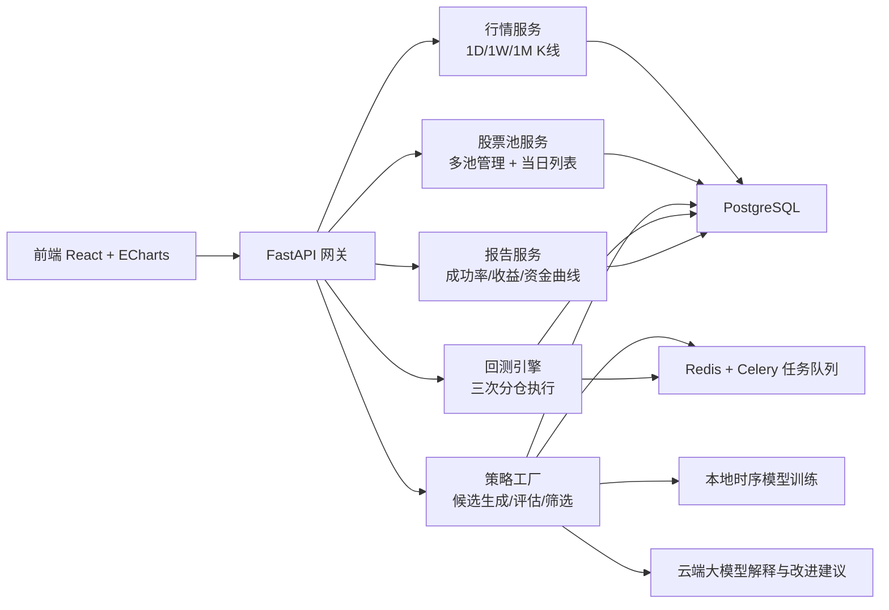
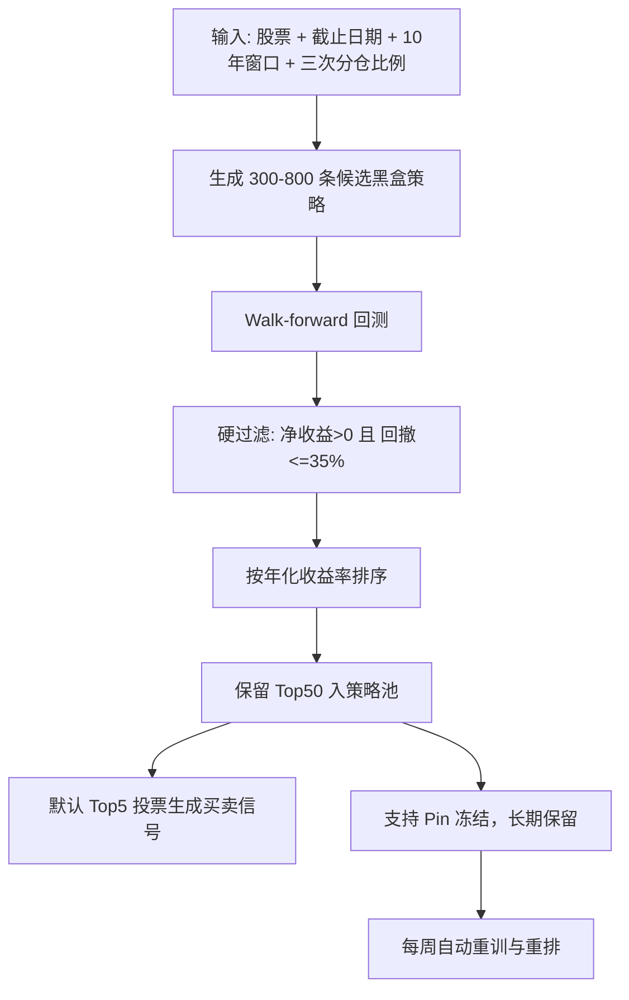
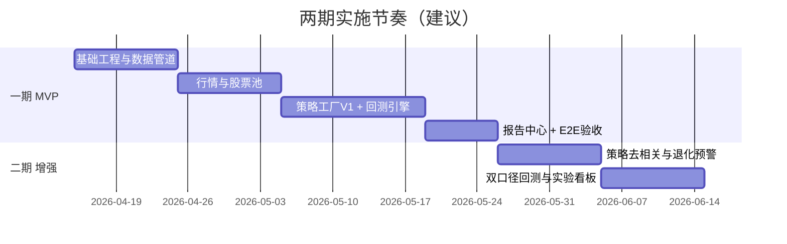

# A股单股 AI 策略研究平台（图文版）PRD

## 一、目标摘要
- 打造一个单用户研究平台：看行情、管股票池、AI 自动挖掘多策略、三次分仓回测、输出盈亏报告。
- 数据范围仅限单股走势（OHLCV 与技术指标），不引入政策面和板块面。
- 策略治理核心：每只股票保留前 50 条策略；`净收益>0` 且 `最大回撤<=35%` 才能入库；评分以年化收益率为第一指标。

## 二、系统架构图


## 三、AI 策略工厂流程图


## 四、里程碑图（两期）


## 五、设备与电脑配置（你关心的“电脑是什么”）
- 本地开发机最低配置
- CPU：8 核以上
- 内存：16GB
- 硬盘：1TB SSD
- 系统：macOS 13+ 或 Windows 11
- 本地开发机推荐配置
- CPU：12 核以上
- 内存：32GB
- 硬盘：2TB SSD
- 显卡：可选 8GB+ 显存（用于更快时序模型训练）
- 服务器（单用户 MVP）
- API/任务机：8 vCPU / 32GB RAM / 500GB SSD
- 数据库机：4 vCPU / 16GB RAM / 500GB SSD
- 可选训练机：1 张中端 GPU（12GB 显存级别）
- 说明：你选“混合模式”后，LLM 解释走云端，本地硬件压力主要在特征工程和回测，不必一开始上高端 GPU。

## 六、实施内容（决策完整）
- 行情模块
- 支持股票代码输入，查看 `日/周/月` K 线。
- 周/月线由日线聚合，保证数据口径一致。
- 股票池模块
- 支持多个股票池（增删改查）。
- 池内展示当日快照列表：收盘、涨跌幅、成交量、换手率。
- AI 策略模块
- 单股特征训练，自动挖掘多策略。
- 只保留“赚钱且回撤达标”策略，最多 50 条。
- 默认执行模式为 Top5 投票，支持切到 Top1。
- 回测模块
- 用户给定股票与截止时间，抓取向前 10 年数据回测。
- 严格三次分仓，比例用户自定义且必须合计 100%。
- 报告模块
- 输出成功率、年化收益率、净盈亏、最终资产、最大回撤、交易明细、资金曲线。
- 明确回答“1 万元最终赚/亏多少”。

## 七、对外接口（核心）
- `GET /api/quotes/{symbol}/candles?tf=1d|1w|1m&from&to`
- `GET /api/quotes/{symbol}/snapshot`
- `POST /api/pools` `GET /api/pools` `PUT /api/pools/{id}` `DELETE /api/pools/{id}`
- `POST /api/strategy-factory/run`
- `GET /api/strategy-factory/jobs/{job_id}`
- `GET /api/strategies?symbol=...`
- `POST /api/strategies/{id}/pin` `DELETE /api/strategies/{id}/pin`
- `POST /api/backtests/run`
- `GET /api/backtests/{id}/report`

## 八、测试与验收
- 单元测试
- K 线聚合正确。
- 三次分仓执行顺序与比例正确。
- 年化收益率排序与 Top50 保留正确。
- 集成测试
- “股票池 -> 策略挖掘 -> 回测 -> 报告”全链路可重复。
- Pin 策略不被淘汰；不达标策略不入库。
- 验收标准
- 单股可稳定产出策略库 Top50。
- 报告可直接给出“1万元最终盈亏金额”。
- 周更重训后策略库可自动更新并可追溯版本。

## 九、默认参数与假设
- 市场：仅 A 股。
- 数据：日终 EOD。
- 用户：单用户本地账户。
- AI：混合模式（本地模型 + 云端解释）。
- 评分：年化收益率优先。
- 风控硬门槛：最大回撤 <= 35%。
- 回测口径：无摩擦（一期默认）。

## 十、A股 K 线数据来源与接入方案
- 生产主数据源：TuShare Pro。
- 接口使用：
- `daily`：A股日线。
- `weekly`：A股周线（至少 2000 积分）。
- `monthly`：A股月线（至少 2000 积分）。
- 研发与兜底数据源：AKShare（东方财富源），用于开发联调、容灾降级。
- 数据策略：
- 主链路优先读 TuShare，若当日主源失败，切换 AKShare 并标记 `source=fallback`。
- 入库统一字段：`trade_date, open, high, low, close, vol, amount, adj`，避免后续模型特征漂移。
- 数据一致性校验：
- 每日采集后对比前一交易日关键字段哈希，异常时触发告警并暂停当日策略重训。

## 十一、云端 AI 资源规划（必须项与可选项）
- 必须项：
- OpenAI API（策略解释、策略优化建议、回测报告自动生成）。
- 模型策略：
- 默认 `gpt-5 mini` 作为日常批处理模型（成本优先）。
- 可按任务升级到更强模型用于复杂策略评审（只在必要任务触发）。
- 可选项：
- 搜索增强（RAG 或联网检索）仅用于补充公开背景信息，不参与价格预测特征，避免“信息泄漏”污染回测。
- 成本控制：
- 全量文本任务优先走 Batch 模式。
- 限制单次策略解释 token 上限，按策略库 TopN 才生成长报告。

## 十二、训练机与运行环境（含 Mac Studio 方案）
- 本地主机（你的目标设备）：
- Mac Studio `M1 Max + 64GB + 1TB` 可用于开发、回测、特征工程、策略筛选与中等规模训练。
- 适配建议：
- 深度模型训练使用 PyTorch MPS；遇到不支持算子允许自动回退 CPU。
- 历史数据、模型与报告文件建议挂载外置高速 SSD（>=2TB），降低 1TB 内置盘压力。
- 云训练机（按需启动，不常驻）：
- 建议规格：单卡 16GB 显存级 GPU（例如 T4/A10 级）用于周更重训批任务。
- 调度方式：
- 每周固定窗口启动训练机执行策略工厂重训，完成后自动关机，避免 24x7 费用。
- 全自动运行架构：
- `cron/调度器 -> 数据采集 -> 特征生成 -> 策略工厂 -> 回测 -> 报告推送` 全链路无人值守。
- 保留人工干预开关：仅用于异常恢复，不参与日常执行。

## 十三、账号开通清单（实施前置）
- 必开账号 1：TuShare Pro 账号（获取 Token + 积分权限）。
- 必开账号 2：OpenAI API 账号（开通 Billing 与 API Key）。
- 按需账号 3：云计算账号（AWS/阿里云/腾讯云任一，用于按需 GPU 重训）。
- 非必须：券商交易账号（当前 PRD 目标是研究与信号，不自动下单）。

## 十四、预算估算（MVP 阶段）
- 说明：以下为规划估算区间，最终以实际调用量与云厂商账单为准。

| 方案 | 组成 | 月成本估算 |
|---|---|---|
| 本地优先（推荐起步） | TuShare + OpenAI，纯本地训练 | 120 - 550 RMB/月 |
| 本地+按需云GPU（推荐稳定版） | TuShare + OpenAI + 云GPU 40-100小时/月 | 240 - 850 RMB/月 |
| 云GPU常开（不推荐） | 24x7 云GPU + TuShare + OpenAI | 2300 RMB+/月 |

- 一次性硬件投入（你拟定方案）：
- Mac Studio `M1 Max 64GB 1TB`：可满足一期与二期前半段研发需求。
- 建议追加：外置高速 SSD（2TB 或以上）用于历史数据与模型仓库。

## 十五、外部依赖与参考链接
- TuShare A股日线 `daily`：<https://tushare.pro/document/2?doc_id=27>
- TuShare A股周线 `weekly`：<https://tushare.pro/document/2?doc_id=144>
- TuShare A股月线 `monthly`：<https://tushare.pro/document/2?doc_id=145>
- TuShare 权限积分说明：<https://tushare.pro/document/2?doc_id=108>
- TuShare 积分与捐助档位：<https://tushare.pro/document/2?doc_id=290>
- AKShare 股票历史行情：<https://akshare.akfamily.xyz/data/stock/stock.html>
- AKShare 说明页：<https://akshare.akfamily.xyz/introduction.html>
- Apple Mac Studio 2022 技术规格：<https://support.apple.com/zh-cn/111900>
- PyTorch MPS：<https://docs.pytorch.org/docs/stable/notes/mps>
- PyTorch MPS fallback：<https://docs.pytorch.org/docs/stable/mps_environment_variables.html>
- OpenAI API Pricing：<https://openai.com/api/pricing/>
- OpenAI 开发者定价细项：<https://developers.openai.com/api/docs/pricing>
- AWS G5g 价格页：<https://aws.amazon.com/ec2/instance-types/g5g/>

## 十六、案例：通达信复合指标接入（候选策略模板）
- 目的：把用户自定义通达信公式作为“候选策略”接入策略工厂，而非直接作为唯一交易规则。
- 适用范围：仅单股行情数据（OHLCV），不依赖政策面和板块面。

### 16.1 接入流程
- 第一步：公式标准化。
- 统一中英文符号、修复拼写与变量命名、补齐函数参数，确保可编译。
- 第二步：信号拆解。
- 输出 `BUY_PT`、`SELL_PT`、`TREND`、`STRONG`、`CASH_PREP` 五类核心信号。
- 第三步：回测评估。
- 采用三次分仓执行器，对该策略进行 10 年滚动回测。
- 第四步：策略入库。
- 满足 `净收益>0` 且 `最大回撤<=35%` 才可入库，再按年化收益率排序参与 Top50。

### 16.2 可运行示例（归一化后）
```txt
YOU:=MA(CLOSE,1);
TYP:=(LOW+HIGH+CLOSE)/3;
MID:=MA(TYP,5);
UP:=HHV(MID,10);
DN:=LLV(MID,10);

FAST_SELL:=IF(HHV(YOU>UP,5),100,50);
SLOW_SELL:=IF(HHV(YOU>UP,10),100,50);
FAST_BUY:=IF(LLV(YOU<DN,5),50,0);
SLOW_BUY:=IF(LLV(YOU<DN,10),50,0);
BUY_PT:=IF(LLV(YOU<DN,10),1,0);
SELL_PT:=IF(HHV(YOU>UP,10),1,0);

TR:=SUM(MAX(MAX(HIGH-LOW,ABS(HIGH-REF(CLOSE,1))),ABS(LOW-REF(CLOSE,1))),5);
HD:=HIGH-REF(HIGH,1);
LD:=REF(LOW,1)-LOW;
DMP:=SUM(IF(HD>0 AND HD>LD,HD,0),5);
DMM:=SUM(IF(LD>0 AND LD>HD,LD,0),5);

STEAL:=DMP*100/TR;
AUX:=DMM*100/TR;
TREND:=MA(ABS(STEAL-AUX)/(STEAL+AUX)*100,3);
ADXR:=(TREND+REF(TREND,3))/2;

V3:=MA(CLOSE,2);
V7:=REF(V3,1);
STRONG:=SMA(MAX(V3-V7,0),5,1)/SMA(ABS(V3-V7),5,1)*100;

CASH_PREP:=IF(TREND>88 AND STEAL<5.8,80,0);
```

### 16.3 在策略工厂中的角色
- 角色定位：该公式作为“规则型候选策略”，与 AI 黑盒策略并行参与评估。
- 融合方式：
- 规则型策略输出离散买卖点；
- AI 模型输出连续 `BuyScore/SellScore`；
- 最终由执行层进行 Top5 投票或加权融合后触发分仓动作。
- 价值：
- 规则清晰、可解释性强；
- 可与黑盒策略互补，提高策略池多样性和抗退化能力。
